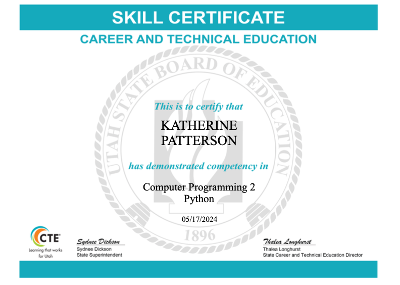

# Programming Portfolio | Kate Patterson | 9720806@graniteschool.org

## Certifications

## Individual Projects
MadLibs Clone: https://github.com/katepatterson/IndividualProject
about: A game where the user makes their own stories by filling out blanks where words have been left out of the story

## Group Project
Bunny Break: https://github.com/9606841/BunnyPrisonGame
Bunny Break: A puzzle game where the player is a bunny who's trying to break out of prison, solving two different puzzles (a memory game and a maze) in order to escape.

## Space Game
OOP graphics games spotlighting objects for user interaction that includes sound and animation

[Source Code](https://github.com/katepatterson/programmingportfolio/blob/main/src/SpaceGame%205.zip)

[Source Code](https://github.com/katepatterson/programmingportfolio/blob/main/src/EtchASketch.pde)

[Source Code](https://github.com/katepatterson/programmingportfolio/blob/main/src/CalculatorFinal.zip)

[Source Code](https://github.com/katepatterson/programmingportfolio/blob/main/src/ScreenSaver.pde)
